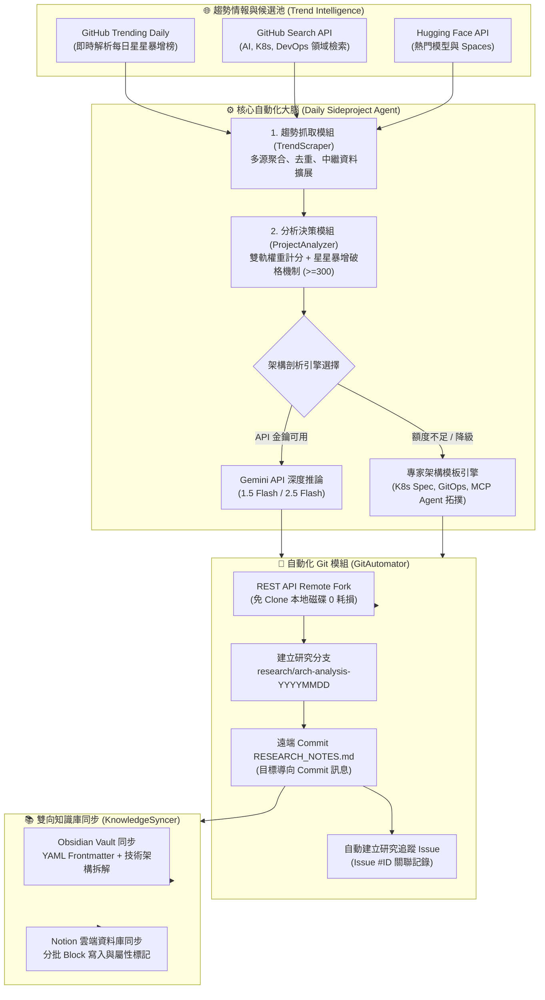
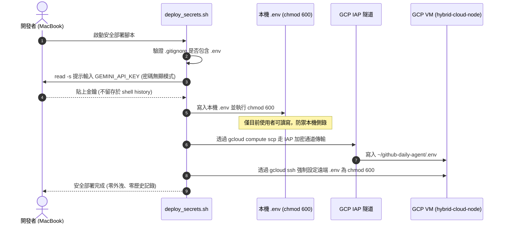
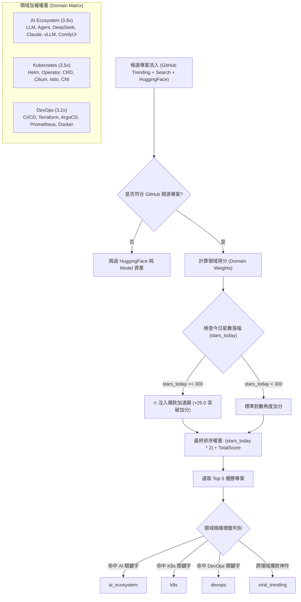

# 🚀 Autonomous GitHub Daily Sideproject Agent

[](https://opensource.org/licenses/MIT)
[](https://www.python.org/)
[](https://cloud.google.com/free)
[](https://kubernetes.io/)
[](https://git-scm.com/)

每天中午 12:00 (Asia/Taipei) 自動巡邏開源技術雷達，即時鎖定 **GitHub Trending 當日星星數漲幅最大的 Top 5 專案**，涵蓋 **AI 生態系 (LLM / Agent / Reasoning / Vision)、Kubernetes (K8s) 與 DevOps**。  
全自動完成**深度架構剖析 (RESEARCH_NOTES.md)**、**無磁碟克隆負擔的遠端 Fork & Branch Commit**、**自動建立 Tracking Issue**，並同步至**本地 Obsidian Vault** 與**雲端 Notion 知識庫**。

---

## 🏗️ 系統架構拓撲圖 (End-to-End System Architecture)



---

## 🔒 零信任安全架構 (Zero-Trust Security Framework)

本專案實施嚴格的安全防護生命週期，防止任何 API 金鑰（Gemini API Key、GitHub Token、Notion Key）外洩至代碼庫或命令日誌中。



### 資安規範五大保證
1. **輸入無顯性**：採用 Bash `read -s`，輸入金鑰時不產生任何字符反射。
2. **本機最小權限**：本機 `.env` 檔案強制鎖定為 `600` (`-rw-------`)。
3. **雲端跳板隔離**：GCP VM 不開放外部公網 IP，僅透過 Google Identity-Aware Proxy (IAP) 安全隧道進行加密傳輸。
4. **遠端權限防禦**：VM 端 `.env` 檔案同樣強制鎖定為 `600`。
5. **代碼防護機制**：`.gitignore` 內建完整排除規則（排除 `.env*`、`*.pem`、`*.key`、`*serviceaccount*.json`、`*.log`）。

---

## 📊 決策矩陣與評分邏輯 (Decision Matrix & Viral Boost)



---

## ☁️ GCP 混合雲永久免費 VM 部署 (hybrid-cloud-node)

本系統部署於 Google Cloud Platform 官方 **Always Free Tier** 之虛擬機器中，實現 **$0/月** 的全天候無人值守運作。

| 項目 | 配置規格 |
|---|---|
| **機器類型** | `e2-micro` (2 vCPUs, 1 GB 記憶體) |
| **部署地區** | `us-central1-a` (包含在 GCP 免費額度內) |
| **磁碟規格** | 30 GB 標準 Persistent Disk (免費額度支援至 30GB) |
| **作業系統** | Ubuntu 22.04 LTS |
| **時區配置** | `Asia/Taipei` (CST, UTC+8) |
| **網路存取** | Google Cloud IAP 專屬通道 (無公網 IP 曝露，極致資安) |

### 遠端 VM Crontab 自動排程
每日中午 12:00 準時自動執行：
```cron
# GCP VM 每日中午 12:00 自動執行
0 12 * * * /home/yi-fanshan/github-daily-agent/run_daily.sh
```

---

## 📈 GCP 服務可視化與可觀測性指南 (Observability & Visualization)

針對 GCP 基礎設施與自動化工作流程的可視化，推薦採用以下最佳實踐：

### 1. 雲端架構圖自動化生成 (Architecture as Code)
* **[Diagrams (Python Library)](https://diagrams.mingrammer.com/)**：
  強烈推薦採用「架構即代碼 (Diagrams-as-Code)」。直接透過 Python 撰寫架構宣告，能在每次 CI/CD 或版本發布時自動渲染出清晰高畫質的 SVG/PNG 拓撲圖。
* **[Hava.io](https://www.hava.io) / [Lucidscale](https://lucid.co/lucidscale)**：
  透過 GCP Service Account API 自動探測真實運行的雲端資源，自動繪製即時拓撲並追蹤架構變更歷程。

### 2. 指標監控：Google Cloud Monitoring vs. Prometheus vs. Grafana

> [!CAUTION]
> **重要架構避坑提醒 (OOM Prevention)**：  
> 當前 GCP 節點為 `e2-micro` (1 GB RAM)。**嚴禁在 VM 本機同時自建運行 Prometheus Server 與 Grafana 實例**，否則極易導致記憶體耗盡 (OOM) 造成 VM 當機！

| 方案維度 | 方案 A：GCP 原生 Cloud Monitoring | 方案 B：Google Managed Prometheus (GMP) | 方案 C：Grafana Cloud 外部整合 |
|---|---|---|---|
| **記憶體負載** | 幾乎為 0 (由 GCP 底層收集) | 超輕量 (僅代管採集) | 0 (使用 Grafana 託管 SaaS) |
| **費用** | **免費** (涵蓋在 GCP 基本配額內) | 基本指標免費 | **免費** (Grafana Free 10k 序列) |
| **配置難度** | ⭐ (開箱即用) | ⭐⭐⭐ (需配置 PromQL) | ⭐⭐ (設定 GCP 服務帳號 Data Source) |
| **視覺化效果** | 實用簡潔，內建 VM 監控看板 | 依賴外部查詢介面 | **極度精美，深色系儀表板首選** |

**💡 推薦落地策略**：
1. **短期最速**：直接於 GCP Console 啟用 **Cloud Monitoring Dashboard**，追蹤 `e2-micro` 的 CPU 峰值、記憶體使用率與磁碟 IO。
2. **長期極致**：註冊 **Grafana Cloud (永久免費額度)**，安裝官方 `Google Cloud Monitoring` 資料源插件，直接在遠端 Grafana 匯入炫砲的 GCP 監控儀表板，完全不佔用 VM 寶貴的 1GB 記憶體！

---

## 📂 專案檔案清單

```text
github-daily-agent/
├── daily_sideproject_agent.py   # 核心工作流引擎 (5 大模組、Top 5 批次處理)
├── deploy_secrets.sh            # 安全環境變數部署腳本 (read -s, chmod 600, IAP 傳輸)
├── run_daily.sh                 # 自動化執行 Entrypoint (排程與日誌導流)
├── .env.example                 # 環境變數範本
├── .gitignore                   # 安全防護忽略清單 (已阻絕所有金鑰與日誌)
├── requirements.txt             # Python 輕量依賴 (requests, urllib3)
└── knowledge_base/
    └── obsidian/                # 本地 Obsidian Vault 產出資料夾
```

---

## 🧪 本地與遠端測試指令

### 1. 乾跑測試 (Dry-Run Mode)
不對 GitHub 與 Notion 產生任何副作用，僅在本地生成 Obsidian 報告與日誌：
```bash
./run_daily.sh --dry-run
```

### 2. 強制測試指定專案
```bash
python3 daily_sideproject_agent.py --force-repo "anthropics/financial-services" --dry-run
```

### 3. 一鍵安全部署至 GCP VM
```bash
./deploy_secrets.sh
```

---

## 📜 授權協議 (License)

本專案基於 [MIT License](LICENSE) 規範開源發布。
