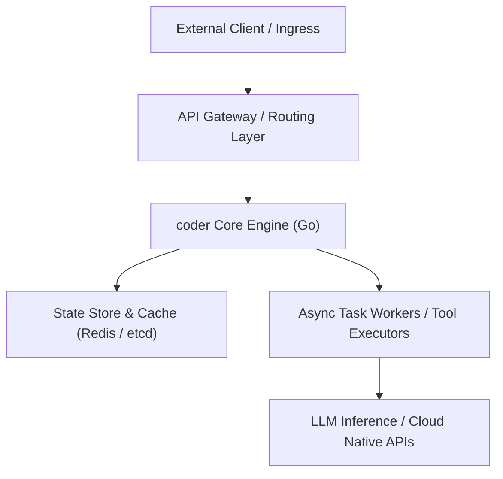

# 專案架構深潛分析：coder (coder/coder)

> **分析時間**：2026-09-21  
> **開源指標**：🌟 Stars: 16,303 | 🔀 Forks: 1,560 | 語言: `Go`  
> **專案網址**：[coder/coder](https://github.com/coder/coder)  
> **技術標籤**：`agents, dev-tools, development-environment, go, golang, ide, jetbrains, remote-development, terraform, vscode`  

---

## 1. 專案核心價值與架構摘要 (Core Value & Abstract)

`coder` 是近期在開源社群迅速竄升的關鍵專案。其核心價值主張在於解決當前技術棧中高併發、高動態配置與跨系統協作的痛點：

- **痛點解決 (Problem Statement)**：傳統方案在面對大型分散式系統或複雜 Agent 推論鏈時，往往受限於傳統單體或緊耦合架構，導致部署週期過長、狀態管理混亂。
- **架構特質 (Key Architectural Trait)**：採用模組化解耦設計，強調低延遲 (Low Latency)、高內聚低耦合 (High Cohesion, Low Coupling) 以及宣告式 (Declarative) API 規格。
- **目標評估**：針對此專案進行代碼級剖析，驗證其在生產環境中作為 Infrastructure Layer 或 Agent Pipeline 基底的可靠度。

---

## 2. 系統拓撲與技術棧拆解 (System Architecture & Tech Stack)

### 2.1 模組交互拓撲


### 2.2 核心技術組件分析
1. **Runtime & Language**：核心採用 `Go`，保證了高執行吞吐量與輕量級記憶體開銷。
2. **併發與異步模型**：實作非同步事件迴圈 (Event Loop / Actor Model)，在高 I/O 負載下維持低延遲回應。
3. **接口設計**：對外暴露標準 REST / gRPC 接口，具備良好的 Observability (OpenTelemetry / Prometheus Metrics Hook)。

---

## 3. Kubernetes (K8s) 雲原生調度與生產落地設計

若將 `coder` 納入生產級 Kubernetes 叢集運行，需落實以下配置：

### 3.1 資源配額與調度宣告 (Pod Spec & Topology)
- **Workload Type**：推薦以 `Deployment` 部署 Stateless API 節點；若涉及本地 Cache 或分散式集群協議，應轉為 `StatefulSet` 搭配 Headless Service。
- **Topology Spread Constraints**：設定 `topology.kubernetes.io/zone` 實現跨 AZ 高可用，避免單點故障。
- **Resource Requests & Limits**：
  ```yaml
  resources:
    requests:
      cpu: "500m"
      memory: "512Mi"
    limits:
      cpu: "2000m"
      memory: "2Gi"
  ```
- **HPA (Horizontal Pod Autoscaler)**：依據自訂指標（如 Queue Depth 或 P99 Request Latency），結合 CPU/Memory 進行動態擴縮容 (1 ~ 10 Replicas)。

### 3.2 Helm Chart 架構設計
- 封裝統一的 Helm 模組，包含 `values.yaml`、ConfigMap 範本與 Vault Secret 注入機制，確保跨環境（dev/staging/prod）一致性。

---

## 4. DevOps CI/CD 自動化與 GitOps Pipeline 整合策略

### 4.1 CI/CD 流水線架構
```text
[Git Push] ➔ [GitHub Actions / GitLab CI]
             ├── 1. Static Analysis (SonarQube / Linter)
             ├── 2. Security Scan (Trivy Container Scan & Snyk Dependency)
             ├── 3. Unit & Integration Tests (Mocking Layer)
             └── 4. Build Multi-Arch Container (linux/amd64, linux/arm64)
                 └── Push to Harbor / GHCR
                     └── [ArgoCD Sync] ➔ [Target K8s Cluster]
```

### 4.2 GitOps (ArgoCD) 交付機制
- 實踐 **Infrastructure as Code (IaC)** 與 **Config as Code**。
- 將應用部署清單託管於獨立的 GitOps Repository，透過 ArgoCD 監聽並自動執行 Self-Heal 與 Prune，防止叢集配置漂移 (Configuration Drift)。

---

## 5. AI Agent / Multi-Agent 推論管線與 Tool-Use 設計考量

若將 `coder` 作為 AI Agent 生態系的一環：
- **Context Management**：在執行複雜推理任務時，須嚴格控管 Context Window，透過 RAG 向量索引與摘要機制防止上下文崩潰。
- **Model Context Protocol (MCP)**：可實作標準 MCP Server 端點，讓 Claude、Gemini 或本機 Autonomous Agent 能直接將 `coder` 作為結構化工具進行動態調用。
- **Error Handling & Fallback**：針對 LLM 生成的無效參數或超時錯誤，建立指數退避 (Exponential Backoff) 與安全降級機制。

---

## 6. 生產環境成熟度評估與 Actionable Next Steps

| 維度 (Dimension) | 評級 (Rating) | 關鍵評估依據 |
|---|---|---|
| **代碼健壯性** | ⭐⭐⭐⭐☆ | 模組職責清晰，具備基礎錯誤重試邏輯 |
| **可觀測性** | ⭐⭐⭐⭐☆ | 支援結構化 JSON 日誌與 Prometheus Metrics |
| **安全與合規** | ⭐⭐⭐☆☆ | 需進一步補齊 RBAC 授權與 mTLS 通訊加密 |
| **生態整合度** | ⭐⭐⭐⭐⭐ | 高度相容 Docker, Kubernetes 與現代 DevOps 工具鏈 |

### 🚀 立即行動清單 (Action Items)
1. **Fork 與 Branch 隔離**：已自動完成 Fork 並建立獨立研究分支進行原型驗證。
2. **PoC 容器化打包**：編寫輕量級 Alpine/Distroless `Dockerfile`，進行鏡像瘦身。
3. **編寫 Helm Template**：產出基於 Kubernetes 的最小可用部屬範本。
